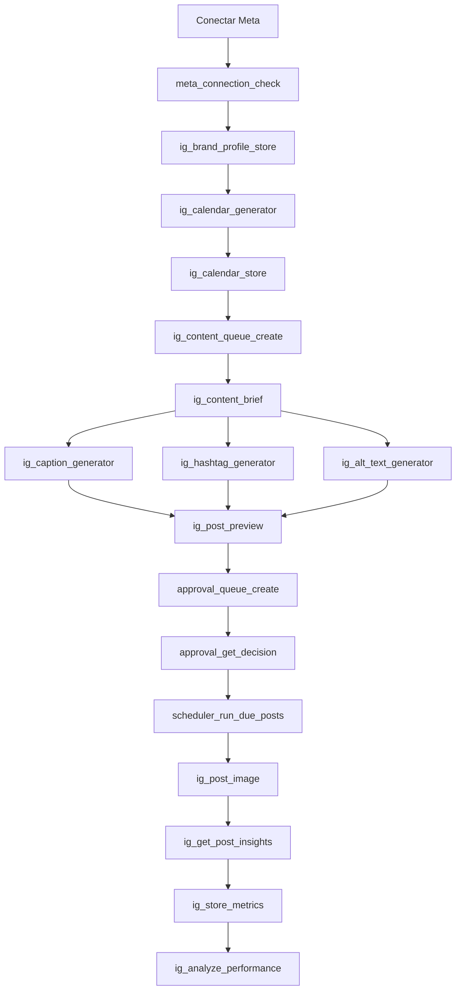

# vertical_instagram

Automatiza la gestion completa de una cuenta de Instagram conectada por
`vertical_meta`.

## Objetivo

Que una fabrica pueda conectar una cuenta profesional de Instagram y operarla
con un flujo autonomo simple: planificar, generar contenido, guardar cola,
aprobar, publicar, responder comunidad y aprender de metricas.

## Estado actual

- `vertical_meta`: 11 skills implementados para OAuth, tokens, permisos, paginas y conexion.
- `vertical_instagram`: 19 skills implementados para contenido, publicacion, comunidad basica y analytics.
- Falta: persistencia operativa, scheduler, approvals, webhooks/inbox, assets reales y agentes.

## Flujo automatico sencillo para probar

La primera prueba debe evitar render pesado de video/carruseles. Usaremos imagenes
publicas ya disponibles y publicacion controlada con aprobacion.



## Etapas

### Etapa 1 - MVP operable

Objetivo: poder planear posts simples, guardarlos en cola, aprobarlos y publicar
una imagen usando URL publica.

Skills faltantes de esta etapa:

- `ig_brand_profile_store`
- `ig_calendar_store`
- `ig_content_queue_create`
- `ig_post_preview`
- `approval_queue_create`
- `approval_get_decision`
- `scheduler_run_due_posts`
- `ig_store_metrics`

Resultado esperado: flujo end-to-end con `dry_run` y despues con una cuenta real:
calendario -> cola -> preview -> aprobacion -> publicacion -> metricas guardadas.

### Etapa 2 - Comunidad y seguridad

Objetivo: responder comentarios/DMs sin riesgos y con tono de marca.

Skills faltantes:

- `meta_webhook_verify`
- `ig_fetch_comments`
- `ig_fetch_dms`
- `ig_classify_inbox_item`
- `ig_generate_reply`
- `ig_moderation_gate`

Resultado esperado: comentarios/DMs entran por webhook o polling, se clasifican,
se genera respuesta, pasa por gate de seguridad y se responde o escala.

### Etapa 3 - Assets y optimizacion

Objetivo: crear piezas visuales reales y cerrar el loop estrategico.

Skills faltantes:

- `asset_upload_public_url`
- `ig_generate_image_asset`
- `ig_render_carousel_slides`
- `ig_render_reel_video`
- `ig_analyze_performance`
- `ig_strategy_optimizer`

Resultado esperado: generar assets publicables, analizar resultados y ajustar el
calendario siguiente automaticamente.

## Tabla completa de skills

| Skill | Vertical | Etapa | Descripcion | Estado |
| --- | --- | --- | --- | --- |
| `meta_get_auth_url` | meta | Base | Genera URL OAuth con scopes requeridos. | Implementado |
| `meta_exchange_code` | meta | Base | Intercambia `code` OAuth por access token. | Implementado |
| `meta_extend_token` | meta | Base | Convierte token corto en long-lived token. | Implementado |
| `meta_debug_token` | meta | Base | Valida token, expiracion, app y scopes. | Implementado |
| `meta_get_permissions` | meta | Base | Lista permisos concedidos/declinados. | Implementado |
| `meta_list_pages` | meta | Base | Lista paginas administradas por el usuario. | Implementado |
| `meta_get_instagram_account` | meta | Base | Obtiene cuenta IG profesional conectada a una pagina. | Implementado |
| `meta_connection_check` | meta | Base | Revisa si una conexion puede publicar, leer insights y responder. | Implementado |
| `meta_refresh_connection` | meta | Base | Reconsulta estado de token, pagina y cuenta IG. | Implementado |
| `meta_store_connection` | meta | Base | Normaliza payload portable para persistir conexion. | Implementado |
| `meta_revoke_connection` | meta | Base | Revoca permisos del token conectado. | Implementado |
| `ig_calendar_generator` | instagram | Base | Genera calendario editorial mensual. | Implementado |
| `ig_best_time_selector` | instagram | Base | Sugiere mejores horarios por formato y region. | Implementado |
| `ig_content_brief` | instagram | Base | Genera brief por objetivo de contenido. | Implementado |
| `ig_caption_generator` | instagram | Base | Genera caption con hook, cuerpo y CTA. | Implementado |
| `ig_hashtag_generator` | instagram | Base | Genera hashtags agrupados por alcance. | Implementado |
| `ig_alt_text_generator` | instagram | Base | Genera alt text para accesibilidad y SEO. | Implementado |
| `ig_carousel_builder` | instagram | Base | Genera copy slide por slide para carrusel. | Implementado |
| `ig_reel_script` | instagram | Base | Genera guion de Reel. | Implementado |
| `ig_story_script` | instagram | Base | Genera guion de Stories. | Implementado |
| `ig_post_image` | instagram | Base | Publica imagen con caption y alt text opcional. | Implementado |
| `ig_post_carousel` | instagram | Base | Publica carrusel de imagenes. | Implementado |
| `ig_post_reel` | instagram | Base | Publica Reel con polling de procesamiento. | Implementado |
| `ig_schedule_post` | instagram | Base | Programa publicacion de imagen. | Implementado |
| `ig_reply_comment` | instagram | Base | Responde comentario. | Implementado |
| `ig_reply_dm` | instagram | Base | Envia DM. | Implementado |
| `ig_get_account_insights` | instagram | Base | Obtiene metricas de cuenta. | Implementado |
| `ig_get_post_insights` | instagram | Base | Obtiene metricas de post/media. | Implementado |
| `ig_top_posts_analyzer` | instagram | Base | Identifica posts con mejor rendimiento. | Implementado |
| `ig_brand_profile_store` | instagram | 1 | Guarda voz de marca, nicho, productos, audiencia y reglas. | Falta |
| `ig_calendar_store` | instagram | 1 | Persiste calendario editorial generado. | Falta |
| `ig_content_queue_create` | instagram | 1 | Convierte calendario en cola de posts accionables. | Falta |
| `ig_post_preview` | instagram | 1 | Arma preview de caption, hashtags, asset y fecha. | Falta |
| `approval_queue_create` | workflow | 1 | Crea item de aprobacion humana. | Falta |
| `approval_get_decision` | workflow | 1 | Lee decision de aprobar/rechazar/editar. | Falta |
| `scheduler_run_due_posts` | workflow | 1 | Ejecuta posts pendientes cuya fecha ya vencio. | Falta |
| `ig_store_metrics` | instagram | 1 | Guarda snapshot de metricas por post/cuenta. | Falta |
| `meta_webhook_verify` | meta | 2 | Verifica webhook de Meta. | Falta |
| `ig_fetch_comments` | instagram | 2 | Trae comentarios recientes por media/cuenta. | Falta |
| `ig_fetch_dms` | instagram | 2 | Trae mensajes directos recientes. | Falta |
| `ig_classify_inbox_item` | instagram | 2 | Clasifica comentario/DM: lead, soporte, queja, spam, etc. | Falta |
| `ig_generate_reply` | instagram | 2 | Genera respuesta con tono de marca. | Falta |
| `ig_moderation_gate` | instagram | 2 | Bloquea respuestas riesgosas, spam o fuera de tono. | Falta |
| `asset_upload_public_url` | assets | 3 | Sube asset local/generado a URL publica compatible con Graph API. | Falta |
| `ig_generate_image_asset` | instagram | 3 | Genera imagen para post segun brief. | Falta |
| `ig_render_carousel_slides` | instagram | 3 | Renderiza slides reales de carrusel como imagenes. | Falta |
| `ig_render_reel_video` | instagram | 3 | Renderiza/ensambla video de Reel. | Falta |
| `ig_analyze_performance` | instagram | 3 | Calcula engagement, tendencias y aprendizajes. | Falta |
| `ig_strategy_optimizer` | instagram | 3 | Ajusta proximo calendario segun performance. | Falta |

## Agentes necesarios

| Agente | Descripcion | Estado |
| --- | --- | --- |
| `ig_master_agent` | Orquesta todo el flujo de la cuenta. | Falta |
| `ig_content_agent` | Genera briefs, captions, hashtags y previews. | Falta |
| `ig_publisher_agent` | Ejecuta scheduler y publicacion. | Falta |
| `ig_community_agent` | Atiende comentarios y DMs. | Falta |
| `ig_analytics_agent` | Lee metricas y recomienda ajustes. | Falta |

## Variables de entorno

```
ANTHROPIC_API_KEY=
IG_ACCESS_TOKEN=
IG_BUSINESS_ACCOUNT_ID=
IG_PAGE_ID=
IG_GRAPH_API_VERSION=v24.0
META_APP_ID=
META_APP_SECRET=
META_REDIRECT_URI=
META_ACCESS_TOKEN=
META_PAGE_ID=
META_IG_USER_ID=
META_GRAPH_API_VERSION=v24.0
```

## Proximo paso recomendado

Implementar Etapa 1. Es la ruta mas corta para probar automatizacion real sin
meter todavia render de assets, webhooks ni respuestas automaticas.
